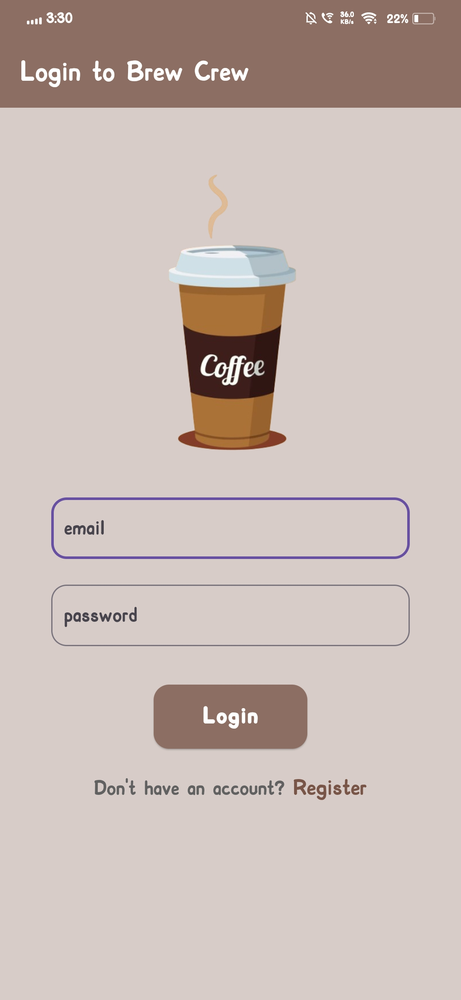
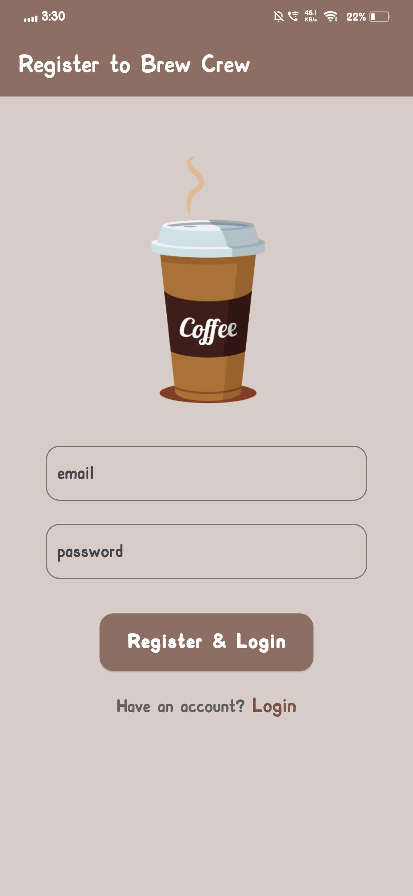
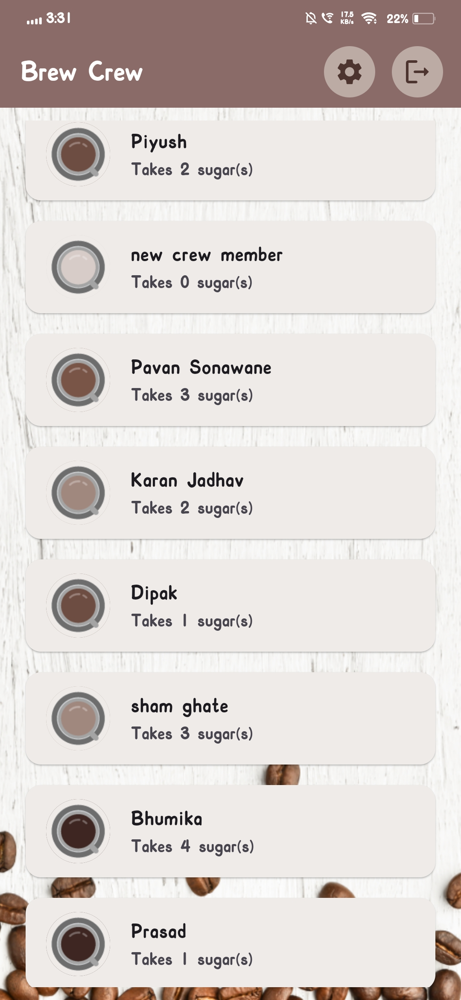
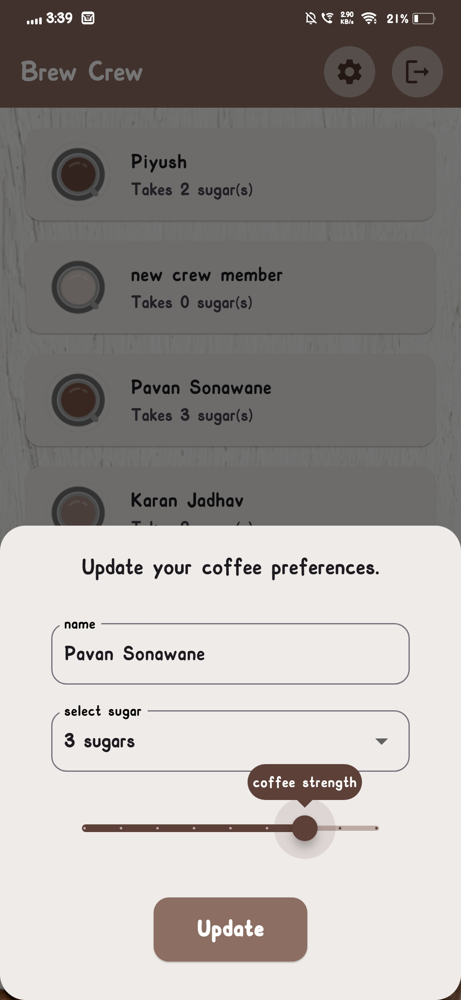
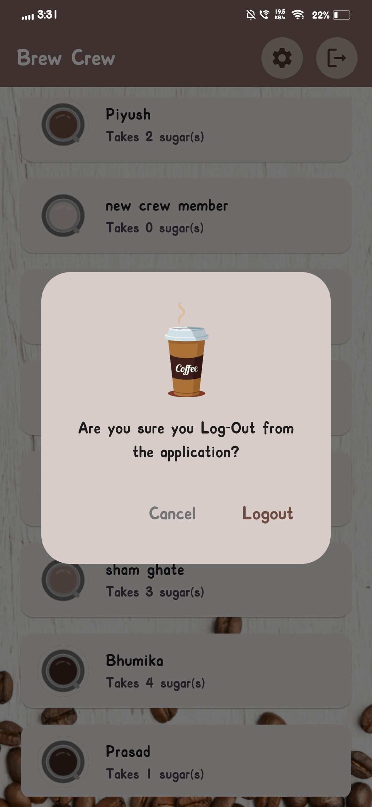

# ☕️ Coffee Preferences App

A sleek Flutter app that lets users register, log in, and manage their coffee preferences. Built with Firebase for authentication and Firestore for real-time data, this app provides a seamless experience for viewing and updating coffee profiles.

[](https://flutter.dev)
[](https://firebase.google.com/)

---

## ✨ Features

- 🔐 **Authentication** – Email & password login/register
- 🏠 **Home** – Browse a list of other users’ coffee preferences
- ⚙️ **Settings** – Update your own preferences (name, sugar level, strength)
- ☁️ **Firebase Firestore** – Real-time data handling
- 🚪 **Logout** – Secure sign-out functionality
- 📱 **Responsive UI** – Clean and simple design for mobile

---

## 🔥 Firebase Services Used

- **Firebase Authentication** – Sign up / log in users securely
- **Cloud Firestore** – Store & retrieve user coffee preferences in real-time

---

## 🖼️ UI Preview

## 🖼️ UI Preview

<table>
  <tr>
    <th>Login</th>
    <th>Register</th>
    <th>Home</th>
    <th>Settings</th>
    <th>Logout</th>
  </tr>
  <tr>
    <td></td>
    <td></td>
    <td></td>
    <td></td>
    <td></td>
  </tr>
</table>

---

## 🚀 Getting Started

**1️⃣ Clone the repo**

```bash
git clone https://github.com/your-username/flutter-coffee-app.git
cd flutter-coffee-app
```

**2️⃣ Install Dependencies**

```bash
flutter pub get
```

**3️⃣ Set Up Firebase**

- 🛠️ Create a Firebase project at [https://console.firebase.google.com](https://console.firebase.google.com)
- 📥 Download the `google-services.json` file
- 📁 Place it in the following directory:

```bash
android/app/
```

**4️⃣ Run the app** 

```bash
flutter run
```
